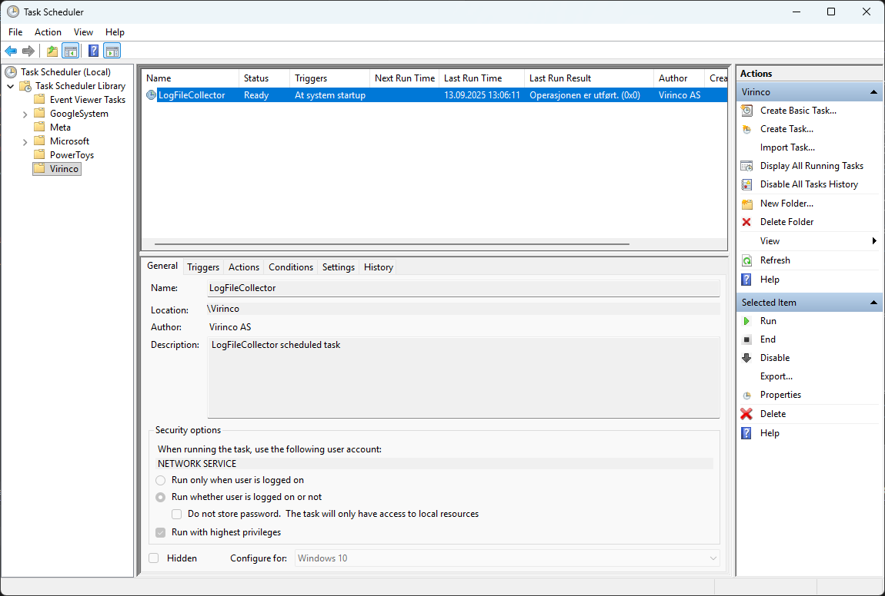

# LogFileCollector

**LogFileCollector** is a headless file-collection service with a built-in web dashboard.  
It builds for **.NET Framework 4.8** (the Windows installer and scheduled task) and for
**.NET 8** (the same collector on Windows, Linux and macOS).  
Author: *Ragnar Engnes for Virinco AS, 2025*  

---

## 🚀 Quick Start  

1. **Download**  
   Go to the [GitHub Releases](../../releases) page and download the ZIP archive:  
   ```
   LogFileCollectorSetup-x.x.zip
   ```  
   This archive contains:  
   - `LogFileCollectorSetup-x.x.exe` → installer  
   - `README.md` → this documentation  
   - `LICENCE.txt` → license terms  

2. **Extract**  
   Unzip the archive to a temporary folder.  

3. **Install**  
   Run the installer:  
   ```
   LogFileCollectorSetup-x.x.exe
   ```  

   > ⚠️ On first run, Windows SmartScreen may warn that the file is from an unknown publisher.  
   > Click **More info → Run anyway** to continue.  

4. **Configure**  
   After installation, edit the opened file:  
   ```
   C:\ProgramData\Virinco\WATS\LogFileCollector\appsettings.json
   ```  

5. **Run**  
   Either:  
   ```powershell
   LogFileCollector.exe --rescan
   ```  
   (one-time rescan + monitoring)  

   Or let the **scheduled task** (if enabled during install) run automatically at boot.  

---

## 📌 Background  
Virinco created this utility because installed custom converters in our **WATS Client** ([download.wats.com](https://download.wats.com)) do not support monitoring of subdirectories — they require a single folder to watch.  

To fill this gap, we built **LogFileCollector**, a lightweight companion utility.  
A more permanent integration is planned directly into WATS Client in the future.

---

## ⚙️ Overview  
LogFileCollector monitors a **source folder** for new files and copies them to a **target folder**.  

- Copied files are **tracked in a persistent SQLite database** to prevent duplicates — even after application restarts.  
- Supports file filters (e.g. `*.log`)  
- Optional **recursive subdirectory monitoring**  
- Fully configurable via `appsettings.json`  
- Designed to run automatically as a **Windows Scheduled Task** at boot  

---

## ✨ Key Features  

- 🔍 **Folder Monitoring**  
  Watches a folder (optionally including all subfolders) for new or updated files.  

- 🗄 **Persistent Tracking**  
  Prevents duplicate copies by recording file `(path, timestamp, size)` in an SQLite database.  

- 📝 **Flexible Configuration**  
  Customize source/target folders, file filter, rename strategy, logging, and more in a single JSON config.  

- 📑 **File Renaming Strategies**  
  Handles duplicate names in target folder:  
  - `counter` → `file_1.log`, `file_2.log`  
  - `timestamp` → `file_20250913_103500.log`  
  - `guid` → `file_a12b34c5.log`  

- 📊 **Logging**  
  Integrated with **Serilog**, configurable for log level, rolling files, retention, and message format.  

- 📊 **Built-in Dashboard**  
  The collector serves its own web UI — live status, throughput chart, the copy history,
  the log tail, a one-click rescan and a validated config editor. See
  [Dashboard](#-dashboard) below.  

- 🔄 **Command-Line Options**  
  - `--rescan` → Perform a full scan of the source folder, copy all missing files, then continue watching.  
  - `--reset` → Clear the tracking database (`copied.db`).  
  - `--config <path>` → Use this `appsettings.json` instead of the one in `ProgramData`.
    Useful for testing, and for running more than one collector on a machine.  

- ⚡ **Scheduled Task Support**  
  The installer can set up LogFileCollector as a Task Scheduler job (`\Virinco\LogFileCollector`) that runs at boot under `NetworkService`.  

---

## 🚀 Installation Details  

The installer (`LogFileCollectorSetup-x.x.exe`) is shipped **inside a ZIP file** for safe distribution.  
This avoids browser/antivirus false positives on direct `.exe` downloads.  

- Installs binaries into:  
  ```
  C:\Program Files\Virinco\LogFileCollector
  ```  

- Installs configuration into:  
  ```
  C:\ProgramData\Virinco\WATS\LogFileCollector\appsettings.json
  ```  

- Optionally creates a **Scheduled Task** in Task Scheduler for automatic startup.  

After installation, `appsettings.json` is opened in Notepad for editing.  

---

## 🔧 Configuration  

**Use the settings form.** The dashboard's gear icon — or *Settings…* in the tray
menu, or the Start Menu shortcut — opens a form covering every setting an operator
needs: source and target folders, filter, subfolders, settle delay, periodic rescan,
collision strategy, logging, and the dashboard address and permissions.

It validates before it writes (a blank folder, or a source equal to the target, is
caught there rather than at the collector's next startup), keeps the previous file as
`appsettings.json.bak`, and preserves any setting it does not itself show. Settings
are read at startup, so apply a change with *Restart service* in the tray menu.

Editing the file by hand still works, and the form shows the exact JSON it will write
under *Advanced*. The reference below documents the file for scripted deployments.

Example `appsettings.json`:  

```json
{
  "SourceFolders": [
    "C:\\Logs\\Input",
    "\\\\server\\share\\station-2\\logs"
  ],
  "TargetFolder": "C:\\ProgramData\\Virinco\\WATS\\OutputFolder",
  "Filter": "*.log",
  "IncludeSubdirectories": true,
  "FileCreatedDelayMs": 500,
  "DatabasePath": "copied.db",
  "RenameStrategy": "counter",
  "Logging": {
    "LogFilePath": "log.txt",
    "LogOutputTemplate": "[{Timestamp:HH:mm:ss} {Level:u3}] {Message:lj}{NewLine}{Exception}",
    "LogLevel": "Information",
    "RollingInterval": "Day",
    "RetainedFileCountLimit": 10,
    "Verbose": true
  },
  "Dashboard": {
    "Enabled": true,
    "UrlPrefix": "http://localhost:8787/",
    "OpenBrowserOnStart": false,
    "AllowConfigEdit": true
  }
}
```

The `Dashboard` section is optional — a configuration file written for v1.1 keeps
working, and the dashboard comes up on its default loopback port.

---

## 📂 Usage  

Run manually from the console:

```powershell
LogFileCollector.exe [--rescan] [--reset] [--config <path>]
```

- No arguments → continuous monitoring  
- `--rescan` → initial full scan, then monitoring  
- `--reset` → delete tracking database  
- `--config <path>` → read configuration from this file instead of `ProgramData`  

---

## 📊 Dashboard  

The collector serves its own UI. Start the collector and open
<http://localhost:8787> in any browser on that machine.

| Panel | What it shows |
| --- | --- |
| Status badge | Watching / Rescanning / Idle / Offline |
| KPI row | Files collected all time, copied this session, skipped as duplicate, errors |
| Files collected per day | Bar chart over the last 7 / 14 / 30 days |
| Watch configuration | Source and target with a live reachability check, filter, settle delay, rename strategy, last file collected, runtime |
| Recently collected | The copy history from the SQLite database, filterable by path |
| Log | Tail of the current Serilog file, colour-coded by level |
| ⚙ Configuration | Edit `appsettings.json` in place — validated before it is written, previous file kept as `.bak` |

The page refreshes every five seconds.

### Why a browser page and not a desktop window

The collector normally runs headless, as a scheduled task or a service, often on a
machine nobody sits at. A page it serves itself can be opened from that machine's
browser — or, deliberately, from an engineer's desk — with nothing extra to install.
It is also the only option that keeps working on .NET 8 on Linux; an embedded
WebView2 host would have tied the UI to Windows.

ECharts is vendored in `WebUI/vendor/`, so the dashboard's charts work on an
air-gapped test floor. Only the web fonts come from a CDN, and the page falls back
to the system font stack without them.

### Network exposure and security

**The dashboard has no authentication.** The default prefix is loopback-only, which
is the intended deployment.

To reach it from another machine, widen the prefix (for example
`http://+:8787/`) and, on Windows, grant the URL ACL to the account the collector
runs under:

```powershell
netsh http add urlacl url=http://+:8787/ user="NT AUTHORITY\NetworkService"
```

Anything that changes state — triggering a rescan, saving the configuration — is
refused unless the request comes from the loopback address, so widening the prefix
gives the network a read-only monitor, not a config editor. Set
`"AllowConfigEdit": false` to disable config writing entirely, or
`"Enabled": false` to not serve the dashboard at all.

---

## 📦 MSI installer  

`WATS-LogFileCollector-Setup.msi` is the preferred way to deploy on Windows: it can
be pushed by GPO or Intune, installs silently, and upgrades in place.

```powershell
# Interactive (double-clicking works too; it needs elevation, so expect a UAC prompt)
msiexec /i WATS-LogFileCollector-Setup.msi

# Silent — must be run from an elevated prompt
msiexec /i WATS-LogFileCollector-Setup.msi /qn

# Uninstall
msiexec /x WATS-LogFileCollector-Setup.msi /qn
```

| | |
| --- | --- |
| Program files | `C:\Program Files\Virinco\LogFileCollector` (service, tray app, `WebUI\`) |
| Configuration | `C:\ProgramData\Virinco\WATS\LogFileCollector\appsettings.json` |
| Service | `WATSLogFileCollector`, automatic start, as `LocalSystem`, restarts on failure |
| Tray app | Starts with Windows via a Startup shortcut |
| Start Menu | Run in the foreground, show the tray icon, edit the configuration, open the dashboard |

The 1.1 scheduled task (`\Virinco\LogFileCollector`) is removed on install — the
service replaces it, and leaving both would collect the same folder twice.

---

## 🔧 How it runs  

There are three pieces, and it matters which does what:

| Piece | Where it runs | What it does |
| --- | --- | --- |
| **Service** `WATSLogFileCollector` | Session 0, from boot, as LocalSystem | Watches the source folders, copies files, serves the dashboard. Runs with nobody logged in. |
| **Tray app** `LogFileCollectorTray.exe` | The logged-in user's session | Status icon and menu, and the dashboard window. Holds no collector logic — it polls the service's dashboard API over loopback. |
| **Dashboard** | Served by the service | The full UI. Opens in an application window from the tray, or in any browser. |

### Why HTTP, when it is a Windows install

The dashboard is served over HTTP and shown in a WebView2 window, rather than being
a WinForms UI. That is deliberate: the service is headless and in session 0, so it
could not draw a window even if it wanted to, and the same page has to work when the
machine is looked at from another desk, and on the .NET 8 build where there is no
WinForms at all. One HTML UI covers all three. The window is what makes it feel like
an installed application rather than a URL to remember.

A Windows service cannot show UI — session 0 isolation — which is why the tray is a
separate process rather than a window the service opens. It is also why the tray can
be closed, restarted or left off entirely without affecting collection.

**Tray menu:** current status, open dashboard, rescan now, edit configuration,
start/stop the service (prompts for elevation), and *Start with Windows*. Double-click
the icon to open the dashboard.

### Autostart

Two independent things, deliberately:

- **The service** starts at boot, set by the installer. Collection does not depend on
  anyone logging in. Change it in `services.msc` or with
  `sc config WATSLogFileCollector start= demand`.
- **The tray icon** starts per-user, via the Startup shortcut the installer creates and
  the *Start with Windows* item in the tray menu (an `HKCU\...\Run` value, no elevation
  needed).

### Running it by hand

`LogFileCollector.exe` with no arguments still runs in the foreground with a console —
useful for diagnosis. Stop the service first, or the two will contend for the dashboard
port.

### A note on LocalSystem

`HttpListener` refuses to bind `http://localhost:<port>/` for a non-administrative
account unless a URL ACL has been reserved for it, so the service runs as LocalSystem
to keep the dashboard binding reliable. Only loopback is bound by default. To run it
under a lower-privileged account instead, reserve the URL first:

```powershell
netsh http add urlacl url=http://localhost:8787/ user="NT AUTHORITY\NetworkService"
sc config WATSLogFileCollector obj= "NT AUTHORITY\NetworkService"
```

`appsettings.json`, the dedup database and the logs are **not** removed by an upgrade
or an uninstall — an upgrade keeps the operator's settings, and a reinstall resumes
where the previous install left off rather than re-copying every file it already has.

Building the MSI (WiX 5, no Inno Setup needed):

```powershell
dotnet build src\Tools\LogFileCollector\LogFileCollector.csproj -c Release -f net48
dotnet build src\Tools\LogFileCollector\Installer\LogFileCollector.wixproj -c Release
# → src\Tools\LogFileCollector\Installer\bin\Release\WATS-LogFileCollector-Setup.msi
```

The Inno Setup script (`LogFileCollector.iss`) is kept for now so the 1.1 release
path still builds, but the MSI is what new deployments should use.

---

## 🏗 Building  

```powershell
# Windows / .NET Framework 4.8 — what the MSI packages
dotnet build -c Release -f net48

# Cross-platform / .NET 8
dotnet build -c Release -f net8.0
dotnet run   -f net8.0 -- --config ./appsettings.json --rescan
```

The `WebUI/` folder is copied next to the executable on build; the collector serves
it from there at runtime, and the MSI carries it into Program Files.

---

## 📝 License  

Copyright © 2025 **Virinco AS**  

Key points:  
- ✅ You may use and modify the software internally.  
- 🚫 Redistribution, resale, or sublicensing of modified versions is **not permitted**.  
- 🛠 Contributions (pull requests) are welcome, but acceptance is at Virinco’s discretion.  
- ⚠️ Software is provided **“AS IS”**, without warranty. Use at your own risk.  

See [LICENSE.txt](./LICENSE.txt) for the complete terms.  

---

## 📊 Workflow  

```
 ┌─────────────────┐
 │   SourceFolder  │   (local path or UNC share)
 └───────┬─────────┘
         │
         ▼
 ┌─────────────────┐
 │  File detected  │  ← FileSystemWatcher or Rescan
 └───────┬─────────┘
         │
         ▼
 ┌───────────────────────────────┐
 │  Check SQLite Database (DB)   │
 │  - FullPath                   │
 │  - LastWriteTimeUtc           │
 │  - Length                     │
 └───────┬─────────┬─────────────┘
         │ Yes     │ No
         │(exists) │(not exists)
         ▼         ▼
   ┌─────────┐   ┌────────────────────┐
   │  Skip   │   │  Copy to Target    │
   │ (already│   │  - Apply rename if │
   │ copied) │   │    needed          │
   └─────────┘   └─────────┬──────────┘
                           │
                           ▼
                  ┌───────────────────┐
                  │  Update Database  │
                  │   (mark copied)   │
                  └───────────────────┘
```

---

## 🖥 Scheduled Task Verification  

When you choose **“Create scheduled task”** during installation, the installer registers  
a Windows Task Scheduler entry:

- Folder: `\Virinco`  
- Task name: `LogFileCollector`  
- Runs as: `NetworkService`  
- Trigger: At system boot  
- Command:  
  ```
  "C:\Program Files\Virinco\LogFileCollector\LogFileCollector.exe" --rescan
  ```

You can verify the task in **Windows Task Scheduler**:  



---

## 📎 Appendix: Using Google Drive (or OneDrive/Dropbox) as Source Folder  

LogFileCollector can also work with **cloud storage folders** such as Google Drive, OneDrive, or Dropbox.  
There are some important considerations:  

### 🔹 Option A – Local Drive Letter (e.g. `G:\`)  
When you install **Google Drive for Desktop**, it mounts your drive as a virtual drive (often `G:\`).  
You can set this path in your `appsettings.json` like:  

```json
"SourceFolder": "G:\\My Drive\\Logs"
```  

⚠️ Limitation:  
- Drive letters (`G:\`) are tied to your interactive session.  
- If LogFileCollector runs as a **scheduled task under NetworkService or SYSTEM**, the drive letter may **not be available**.  

---

### 🔹 Option B – UNC Path (Recommended)  
Google Drive also exposes a UNC path, usually:  

```
\\GoogleDrive\My Drive\Logs
```

In `appsettings.json` (escape backslashes):  

```json
"SourceFolder": "\\\\GoogleDrive\\My Drive\\Logs"
```  

✅ Benefits:  
- Works in scheduled tasks (even under NetworkService).  
- More robust than using drive letters.  

---

### 🔹 Option C – Run Task as Your User  
If UNC paths are not available or not reliable in your environment, you can run the scheduled task as your **Windows user account**:  

- Open Task Scheduler → Properties → “Run as user” → select your account.  
- Enable “Run whether user is logged on or not”.  

This ensures the mapped Google Drive letter (`G:\`) is available.  

---

### 🔹 Notes for Other Cloud Drives  
- **OneDrive** → Use `%USERPROFILE%\OneDrive\...` or UNC path if available.  
- **Dropbox** → Typically `%USERPROFILE%\Dropbox\...`.  
- General rule: Prefer UNC/local paths over mapped drive letters.  

### 🔹 Permissions

LogFileCollector only needs read access to the source folder.
All duplicate detection and tracking is handled internally via the local SQLite database (copied.db).
Write permissions are only required for the target folder where files are copied.
